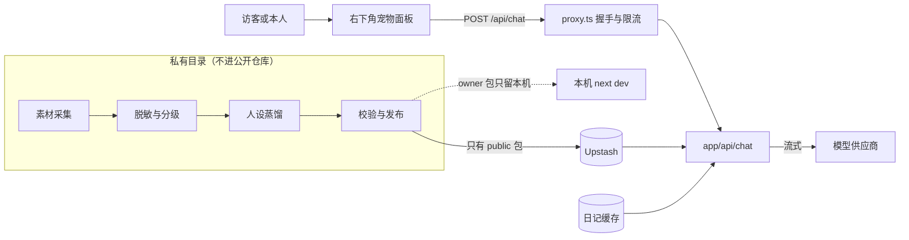

# 右下角 AI 数字人

博客右下角的像素宇航员，点开是以作者口吻对话的 AI 分身。本仓库只放线上对话框架；人设内容在私有目录离线蒸馏、发布到 Upstash，不进 Git。

## 1 整体链路

## 2 两级人设

| 级别 | 在哪里用 | 事实来源 | 存放位置 |
|---|---|---|---|
| public | 线上，访客与管理员都用这一份 | 已公开的博客与公开过的观点 | Upstash `dr:persona:public:v1` |
| owner | 只在本机开发环境 | 全部记忆，含私密日记 | 本机 `PERSONA_BUNDLE_DIR`，不上传任何线上存储 |

线上只存 public 包。访客能用提示注入把上下文整段套出来，管理员登录也可能被攻破，所以线上能套到的上限就是 public 包的内容；全部记忆只在本机 `next dev` 时从本地目录读取。凭据类信息（密钥、口令、IP 等）两级都不进包。

人设包结构见 `lib/persona/types.ts`：`identity`（我是谁）、`voice`（怎么说）、`logic`（怎么想）、`memory`（记得什么）、`boundaries`（边界）、`exemplars`（语气示范）、`notes`（可检索记忆片段）、`starters`（开场问题）。读入时做结构校验，不合格按「未发布」处理。提示词与检索范围按实际加载到的包决定，不按请求者身份决定。

## 3 线上对话

- 入口：`components/pet/PetLauncher.tsx` 挂在根 layout，只在会签发握手的页面显示（封面除外）；面板首次打开时才加载。
- 面板：右侧贴边、从顶到底的侧栏（同 Notion AI），宽屏时页面整体让位不被遮挡，手机上全屏；只有标题、消息与输入框。
- 接口：`app/api/chat/route.ts`。`GET` 返回是否可用与开场问题，`POST` 流式返回纯文本。
- 守卫：在 `proxy.ts` 受保护列表内，访客必须先过 PoW 握手；路由内再做同源校验与每分钟限流。访客另有每 IP 每日 30 轮、全站每日 600 轮的额度，超额不记违规、不封 IP。生产环境没有 Redis 时拒绝服务。
- 检索：每轮用最近两句提问，在日记缓存与人设包 `notes` 里做字二元组打分，取最相关的 4 段放进上下文，带站内链接便于引用。只读缓存，不触发 Notion 冷拉。
- 渲染：`lib/chat-markdown.ts` 独立 marked 实例，白名单去掉图片，防止回复被注入后用外链图片带出数据。
- 对话只存在当前标签页的 sessionStorage，服务端不留存。

## 4 配置

| 变量 | 说明 |
|---|---|
| `NEXT_PUBLIC_PET_MODE` | `off`（默认）/ `owner`（宠物仅管理员可见，内容仍是 public 包，用于上线前自测）/ `public`（对访客开放）。改了要重新部署 |
| `PERSONA_LLM_PROTOCOL` | `openai`（默认）或 `anthropic` |
| `PERSONA_LLM_API_KEY` | 模型密钥；openai 协议下缺省时沿用 `OPENAI_API_KEY` |
| `PERSONA_LLM_BASE_URL` | 供应商地址；openai 协议下缺省时沿用 `OPENAI_BASE_URL` |
| `PERSONA_LLM_MODEL` | 模型名；openai 协议下缺省时沿用 `AI_MODEL` |
| `PERSONA_BUNDLE_DIR` | 仅本机开发环境：从目录读 `public.json` / `owner.json`，不碰线上 Redis；生产环境忽略 |

## 5 上线顺序

1. 私有目录跑完蒸馏；owner 包复制到本机目录自用，public 包过泄露扫描后发布。
2. Vercel 配好模型变量，`NEXT_PUBLIC_PET_MODE=owner` 部署，自己登录后试聊、校人设。
3. 确认 public 包里没有私密内容后改成 `public` 重新部署。
